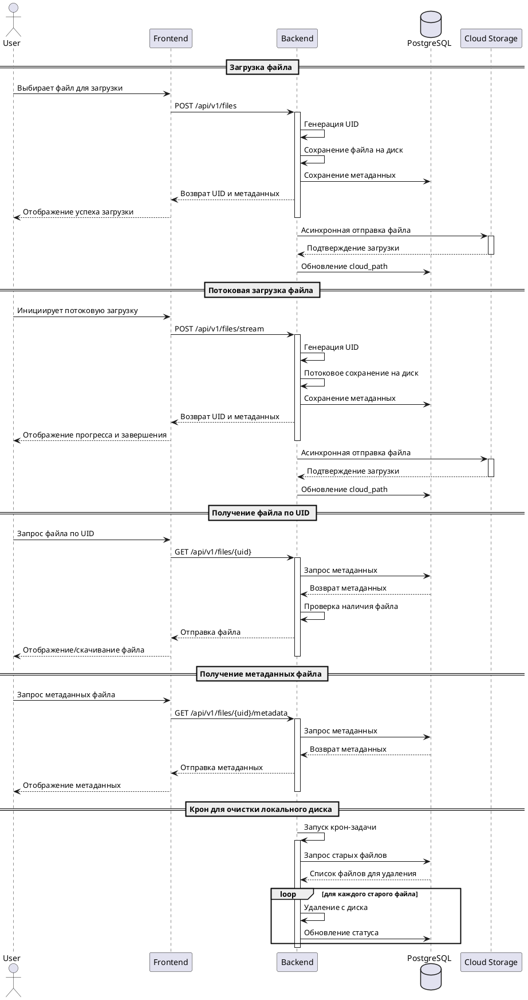

Тестовое задание на позицию Middle Backend разработчик (Python)

# Задача

Разработать REST API микросервис для приёма, обработки и управления медиафайлами. Микросервис должен уметь принимать файлы через HTTP-запросы, сохранять их на локальный диск и отправлять копию в облачное хранилище. Для каждого файла должен быть сгенерирован уникальный идентификатор (UID), который будет использоваться для дальнейшей работы с файлом. Кроме того, необходимо сохранять метаданные файла в базу данных, включая размер, формат, оригинальное название и расширение файла.

Технологический стек:

Язык программирования: Python
Web-фреймворк: FastAPI

База данных: PostgreSQL

ORM: SQLAlchemy

Облачное хранилище: Использование условного API для демонстрации интеграции

Функциональные требования:

Приём файлом: API должен поддерживать загрузку файлов через HTTP POST запросы. Файлы могут быть любого типа (например, изображения, видео, аудио).

Потоковый приём файлов: API должен поддерживать загрузку файлов через стрим. Файлы могут быть любого типа (например, изображения, видео, аудио).

Сохранение файлов на диск: После приёма файл должен сохраняться на сервере.

Отправка в облако: Копия файла должна быть асинхронно отправлена в облачное хранилище.

Генерация UID: Для каждого файла должен быть сгенерирован уникальный идентификатор.

Сохранение метаданных: Метаданные каждого файла должны быть сохранены в базе данных PostgreSQL через SQLAlchemy. Метаданные включают размер файла, формат, оригинальное название и расширение.

Дополнительные задачи (Бонус):

Крон для очистки локального диска: Реализовать крон задачу, которая будет регулярно очищать старые или неиспользуемые файлы с локального диска.

Ручка для получения файла по UID: Реализовать API-метод для получения файла по его уникальному идентификатору, с возможностью скачивания файла.

Требования к коду:

Код должен быть чистым, хорошо структурированным и комментированным.

Решение должно включать обработку ошибок и базовые тесты функциональности.

# PlantUML схема (диаграмма последовательности)

